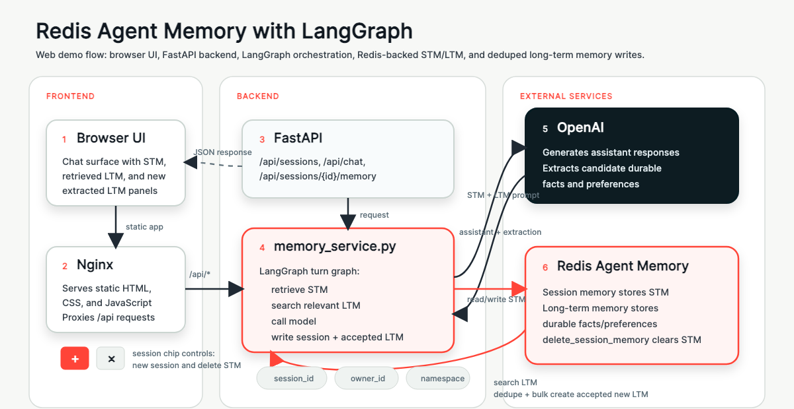

# Redis Agent Memory with LangGraph Demo

## Overview

This demo demonstrates how [Redis Agent Memory](https://pypi.org/project/redis-agent-memory/) can add memory to a LangGraph agent. Built with Python, LangGraph, OpenAI, and the `redis-agent-memory` Python client, it shows how an agent can use session-scoped short-term memory for the current conversation and durable long-term memory for user facts and preferences across sessions.

The demo runs as an interactive terminal assistant. You type messages into the agent, observe how session memory and long-term memory are stored and retrieved, inspect data using Redis Insight when useful, start a fresh session, and then ask follow-up questions that rely on durable long-term memory.

## Table of Contents

- [Demo Objectives](#demo-objectives)
- [Setup](#setup)
- [Running the Demo](#running-the-demo)
- [Architecture](#architecture)
- [Known Issues](#known-issues)
- [Resources](#resources)
- [Maintainers](#maintainers)
- [License](#license)

## Demo Objectives

- Demonstrate Redis as a memory persistence layer for agentic applications.
- Show how to integrate Redis Agent Memory through the Python client.
- Illustrate the LangGraph pattern of retrieving short-term and long-term memory before an LLM call.
- Show the difference between session-scoped short-term memory and durable long-term memory.
- Keep current conversation details in short-term memory while extracting only durable facts and preferences into long-term memory.
- Provide a simple way to verify your Redis Agent Memory service endpoint.

## Setup

### Dependencies

- [Docker](https://docs.docker.com/get-docker/) for Docker-based runs
- [uv](https://docs.astral.sh/uv/) for local Python runs
- [Redis Agent Memory Server](https://redis.github.io/agent-memory-server)
- [Redis Insight](https://redis.io/insight/) for optional memory inspection
- [OpenAI API key](https://platform.openai.com/api-keys)

### Account Requirements

| Account                                          | Description                                                    |
|:-------------------------------------------------|:---------------------------------------------------------------|
| [OpenAI](https://auth.openai.com/create-account) | LLM used to generate assistant responses and extract memories. |
| [Redis Agent Memory](https://redis.io/try-free)  | Fully managed service for agent memory backed by Redis Cloud.  |

This demo does not deploy Redis Agent Memory Server. Before running the demo, make sure you have an Agent Memory Server data-plane URL, store ID, and API key.

### Configuration

#### Docker Setup

1. Clone the repository:

   ```sh
   git clone <repository-url>
   cd redis-agent-memory-with-langgraph-demo
   ```

2. Create your environment file:

   ```sh
   cp .env.example .env
   ```

3. Edit `.env` with your configuration:

| Variable                    | Required | Description                                                   |
|:----------------------------|:--------:|:--------------------------------------------------------------|
| `OPENAI_API_KEY`            | Yes      | API key used by the LangGraph agent.                          |
| `AGENT_MEMORY_SERVER_URL`   | Yes      | Agent Memory Server data-plane base URL.                      |
| `AGENT_MEMORY_STORE_ID`     | Yes      | Store ID used by the Agent Memory Server API.                 |
| `AGENT_MEMORY_API_KEY`      | Yes      | API key used by the Agent Memory Server API.                  |
| `OPENAI_MODEL`              | No       | OpenAI model used for responses and memory extraction.        |
| `DEMO_OWNER_ID`             | No       | Stable user identifier for long-term memories.                |
| `DEMO_NAMESPACE`            | No       | Logical namespace for this demo's memories.                   |
| `DEMO_AGENT_ID`             | No       | Actor ID used when writing assistant session events.          |

4. Build and run the interactive demo:

   ```sh
   docker compose run --rm demo
   ```

#### Local Python Setup

If you prefer to run the demo without Docker, use the checked-in lockfile:

```sh
cp .env.example .env
uv sync --locked
uv run python demo.py
```

Edit `.env` before starting the demo.

If you previously created `.venv` with a different Python version and see an error like `ModuleNotFoundError: No module named 'encodings'`, recreate the environment:

```sh
deactivate 2>/dev/null || true
rm -rf .venv
uv sync --locked
uv run python demo.py
```

## Running the Demo

Start the interactive assistant:

```sh
docker compose run --rm demo
```

If you installed the demo locally with Python, use:

```sh
uv run python demo.py
```

The demo opens an interactive prompt:

```text
👤 You>
```

Each turn prints the short-term memory loaded for the current session, the relevant long-term memories retrieved for the current request, and any newly extracted long-term memories.

### Memory Model

The demo intentionally separates two memory scopes:

| Memory scope      | Backed by Redis Agent Memory | Used for                                                    |
|:------------------|:-----------------------------|:------------------------------------------------------------|
| Short-term memory | Session memory               | Current conversation context, active itinerary details, and follow-up continuity. |
| Long-term memory  | Long-term memory             | Durable user facts, persistent preferences, and stable constraints. |

Current trip details such as dates, destinations, and booking requests stay in short-term memory unless the user explicitly asks the agent to remember them for later. Durable details such as a user's name or recurring travel preferences can be extracted into long-term memory.

### Examples of Interactions

- "My name is Ricardo."
- "Remember that I prefer short answers."
- "I like vegetarian restaurants, but I do not like cilantro."
- "I am planning a trip to Lisbon next month."
- `/new`
- `/delete`
- "Fresh session: what do you remember about me?"
- "Can you recommend a dinner plan for Lisbon?"

### Useful Commands

- `/new` starts a fresh short-term memory session while keeping the same long-term memory owner.
- `/delete` deletes short-term memory for the current session while keeping long-term memory intact.
- `/quit` exits the demo.

### Suggested Recording Flow

1. Start the demo with `uv run python demo.py`.
2. Ask for help with a multi-turn travel request and notice the session context appearing as short-term memory.
3. Tell the agent a durable fact or recurring preference.
4. Inspect Redis Insight to show session events and newly extracted long-term memory.
5. Type `/new` to start a fresh short-term memory session.
6. Ask the agent a question that relies on durable long-term memory.
7. Use `/delete` to delete the current session memory without deleting durable long-term memory.
8. Inspect Redis Insight again to show the memory being reused.

## Architecture

The demo uses LangGraph to model one agent turn as a small graph while Redis Agent Memory provides both session-scoped short-term memory and durable long-term memory:

1. Retrieve the current session memory from Redis Agent Memory as short-term memory.
2. Retrieve relevant long-term memories from Redis Agent Memory.
3. Inject both memory contexts into the OpenAI system prompt.
4. Generate the assistant response.
5. Write the user and assistant messages as session events.
6. Extract only durable facts and preferences from the turn.
7. Write extracted long-term memories back to Redis Agent Memory.



## Known Issues

- The demo requires a reachable Agent Memory Server data-plane endpoint.
- Memory extraction is performed by the LLM, so phrasing can vary between runs.
- The demo uses Redis Agent Memory session APIs for short-term memory, not LangGraph's native checkpointer interface.
- Re-running the same durable fact may create the same deterministic memory ID and depend on server-side idempotency behavior.
- Redis Insight inspection depends on how your Agent Memory Server stores data internally.

## Resources

- [Redis Agent Memory](https://pypi.org/project/redis-agent-memory/)
- [LangGraph documentation](https://langchain-ai.github.io/langgraph/)
- [OpenAI API documentation](https://platform.openai.com/docs)
- [Redis Insight](https://redis.io/insight/)

## Maintainers

**Maintainers:**
- Ricardo Ferreira — [@riferrei](https://github.com/riferrei)

## License

This project is licensed under the MIT License.
